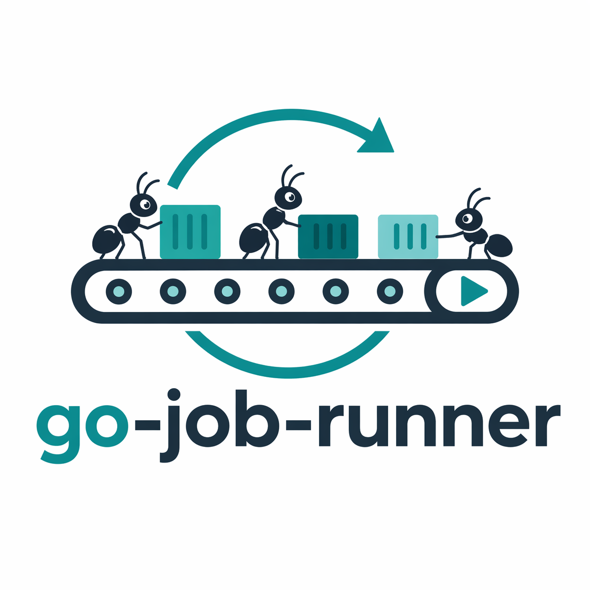

<div align="center">



# job-runner

**내장 Web UI를 갖춘 경량 Docker 워크로드 스케줄러.**

cron 또는 인터벌 스케줄로 Docker 이미지 워크로드를 실행합니다. 실행 이력, 로그, 아티팩트를 SQLite 외에 외부 의존성 없이 디스크에 완전히 저장합니다.

[](https://hub.docker.com/r/hoonzinope/image-job-runner)
[](LICENSE)
[](go.mod)

[English](README.md)

</div>

---

## 목차

- [기능](#기능)
- [아키텍처](#아키텍처)
- [빠른 시작](#빠른-시작)
- [설정](#설정)
- [API 레퍼런스](#api-레퍼런스)
- [Web UI](#web-ui)
- [샘플 이미지](#샘플-이미지)
- [개발](#개발)
- [프로젝트 구조](#프로젝트-구조)
- [라이선스](#라이선스)

---

## 기능

- **Cron & 인터벌 스케줄** — 표준 cron 표현식 또는 타임존을 지원하는 고정 초 단위 인터벌
- **동시성 정책** — `allow` (병렬 실행) 또는 `forbid` (이미 실행 중이면 건너뜀)
- **재시도 & 타임아웃** — 잡별로 설정 가능한 재시도 횟수 및 실행 타임아웃
- **영구 실행 이력** — 모든 실행, 이벤트, 로그, 아티팩트를 SQLite를 통해 로컬에 저장
- **Web UI** — 브라우저에서 잡과 실행 목록 조회, 로그 확인, 실행 트리거/취소
- **REST API** — `/api/v1` 아래 완전한 CRUD 및 운영 엔드포인트 제공
- **이중 이미지 소스** — 로컬 경로 또는 원격 레지스트리에서 이미지 가져오기
- **실행기 정책** — Docker 실행은 문서화된 네트워크/리소스 설정으로 제한되며, privileged 모드와 임의 volume mount는 노출하지 않음
- **자급자족** — 단일 바이너리, 단일 설정 파일, 외부 브로커나 데이터베이스 서버 불필요

---

## 아키텍처

```
┌──────────────────────────────────────────┐
│                  job-runner              │
│                                          │
│  ┌─────────────┐   ┌──────────────────┐  │
│  │  REST API   │   │     Web UI       │  │
│  │  /api/v1    │   │  /jobs  /runs    │  │
│  └──────┬──────┘   └────────┬─────────┘  │
│         │                   │            │
│  ┌──────▼───────────────────▼─────────┐  │
│  │            Service Layer           │  │
│  └──────────────────┬─────────────────┘  │
│                     │                    │
│  ┌──────────────────▼─────────────────┐  │
│  │             Scheduler              │  │
│  │  due-job loop → dispatch loop      │  │
│  │            → worker goroutines     │  │
│  └──────────────────┬─────────────────┘  │
│                     │                    │
│  ┌──────────────────▼──────────────────┐ │
│  │   SQLite Store  │  Docker Executor  │ │
│  │  jobs/runs/     │  image pull       │ │
│  │  events/logs    │  container run    │ │
│  └─────────────────┴───────────────────┘ │
└──────────────────────────────────────────┘
```

**스케줄러 내부 루프:**

| 루프 | 역할 |
|---|---|
| Due-job 루프 | `next_run_at`를 스캔하여 `pending` 실행을 삽입 |
| Dispatch 루프 | `pending` 실행을 가져와 워커에 전달 |
| Worker 고루틴 | 이미지 확인 → 풀 → 컨테이너 실행 → 로그 기록 → 상태 업데이트 |

---

## 빠른 시작

### 1. 이미지 pull

```bash
docker pull hoonzinope/image-job-runner:latest
# 또는 특정 릴리즈 버전으로 고정
docker pull hoonzinope/image-job-runner:v1.0.1
```

### 2. 설정 파일 생성

```bash
mkdir -p ~/docker_v/image-job-runner
cp config.example.yaml ~/docker_v/image-job-runner/config.yml
# 필요에 맞게 파일 수정
```

### 3. 실행

```bash
docker run -d --name image-job-runner \
  -p 8888:8888 \
  -v ~/docker_v/image-job-runner/config.yml:/app/config.yml:ro \
  -v ~/docker_v/image-job-runner:/app/data \
  -v /var/run/docker.sock:/var/run/docker.sock \
  hoonzinope/image-job-runner:latest
```

### 4. UI 열기

```
http://localhost:8888/jobs
```

> 보안 안내: 내장 Web UI와 REST API에는 인증/인가 기능이 없습니다. 서버를 `0.0.0.0` 또는 다른 non-loopback 주소에 바인딩할 경우, 외부에 노출하기 전에 인증이 붙은 reverse proxy, VPN, 또는 IP allowlist 뒤에 두세요.

---

## 설정

저장소에는 템플릿으로 `config.example.yaml`이 포함되어 있습니다. 실제 사용할 설정은 저장소 외부에 보관하세요.

```yaml
server:
  # 로컬 전용이면 127.0.0.1을 사용하세요.
  # 0.0.0.0에 바인딩하면 UI/API가 네트워크에 노출됩니다.
  host: 0.0.0.0
  port: 8888

store:
  sqlite_path: ./data/app.db
  log_root: ./data/logs
  log_path_pattern: job-%d/run-%d/run.log
  artifact_root: ./data/artifacts
  result_path_pattern: job-%d/run-%d/result.json

scheduler:
  due_job_scan_interval_sec: 2   # 실행 예정 잡을 확인하는 주기
  dispatch_scan_interval_sec: 1  # 대기 중인 실행을 디스패치하는 주기
  max_concurrent_runs: 2         # 전역 워커 풀 크기

image:
  allowed_sources:               # 허용되는 소스 타입
    - local
    - remote
  default_source: local
  pull_policy: if_not_present    # always | if_not_present | never
  allowed_prefixes:              # 이미지 ref는 아래 중 하나로 시작해야 함
    - example-image/
    - jobs/
  remote:
    endpoint: http://192.168.215.1:5001
    insecure: true

executor:
  network_mode: bridge           # bridge | none; host는 의도적으로 거부됨
  read_only_rootfs: false        # 워크로드 확인 후에만 활성화
  memory_limit_mb: 0             # 0 = 제한 없음
  cpu_limit: 0                   # 0 = 제한 없음
```

### 주요 필드

| 필드 | 설명 |
|---|---|
| `store.sqlite_path` | SQLite 데이터베이스 파일 경로 |
| `store.log_root` | 실행 로그 파일의 루트 디렉터리 |
| `store.artifact_root` | 실행 결과/아티팩트 파일의 루트 디렉터리 |
| `scheduler.max_concurrent_runs` | 동시에 실행 가능한 최대 실행 수 |
| `image.pull_policy` | `always`는 매 실행마다 재풀; `if_not_present`는 이미지가 있으면 생략 |
| `image.allowed_prefixes` | 이미지 ref 접두사 허용 목록; 목록 외의 요청은 거부됨 |
| `executor.network_mode` | 잡 컨테이너의 Docker 네트워크 모드; `bridge`와 `none`만 허용 |
| `executor.read_only_rootfs` | `true`일 때 잡 컨테이너를 read-only root filesystem으로 실행 |
| `executor.memory_limit_mb` | 잡 컨테이너의 선택적 메모리 제한 (`0`이면 미설정) |
| `executor.cpu_limit` | 잡 컨테이너의 선택적 CPU 제한 (`0`이면 미설정) |

내장 인증은 제공되지 않습니다. 서비스가 non-loopback 주소에서 접근 가능하다면, 신뢰할 수 있는 환경 밖에서 사용하기 전에 reverse proxy, VPN, 또는 IP allowlist로 보호하세요.

Docker 실행기는 호스트 Docker 소켓을 사용하므로, 러너는 로컬 Docker daemon에 영향을 줄 수 있습니다. 이 저장소는 privileged 모드와 임의 volume mount를 config로 노출하지 않습니다. 네트워크 모드와 리소스 제한만 실행기 수준에서 지원하며, 그 외 옵션은 현재 범위 밖으로 봐야 합니다.

---

## API 레퍼런스

모든 엔드포인트는 `/api/v1` 아래에 있습니다.

### Jobs

| 메서드 | 경로 | 설명 |
|---|---|---|
| `GET` | `/api/v1/jobs` | 잡 목록 조회 (페이지네이션) |
| `POST` | `/api/v1/jobs` | 잡 생성 |
| `GET` | `/api/v1/jobs/:id` | 잡 조회 |
| `PUT` | `/api/v1/jobs/:id` | 잡 수정 |
| `DELETE` | `/api/v1/jobs/:id` | 잡 삭제 |
| `POST` | `/api/v1/jobs/:id/trigger` | 잡 즉시 트리거 |
| `GET` | `/api/v1/jobs/:id/runs` | 잡의 실행 목록 조회 |

**잡 요청 본문 필드:**

| 필드 | 타입 | 설명 |
|---|---|---|
| `name` | string | 고유한 잡 이름 |
| `enabled` | bool | 잡 활성화 여부 |
| `sourceType` | `local` \| `remote` | 이미지 소스 |
| `imageRef` | string | 이미지 참조 (예: `jobs/my-image:latest`) |
| `scheduleType` | `cron` \| `interval` | 스케줄 타입 |
| `scheduleExpr` | string | Cron 표현식 (`scheduleType=cron`일 때) |
| `intervalSec` | number | 인터벌 초 단위 (`scheduleType=interval`일 때) |
| `timezone` | string | IANA 타임존 (기본값: `UTC`) |
| `concurrencyPolicy` | `allow` \| `forbid` | 잡이 이미 실행 중일 때의 동작 |
| `retryLimit` | number | 실패 시 재시도 횟수 (0 = 재시도 없음) |
| `timeoutSec` | number | 실행 타임아웃 초 단위 (0 = 타임아웃 없음) |
| `params` | object | 컨테이너에 환경 변수로 전달되는 임의 JSON |

### Runs

| 메서드 | 경로 | 설명 |
|---|---|---|
| `GET` | `/api/v1/runs` | 실행 목록 조회 (페이지네이션) |
| `GET` | `/api/v1/runs/:id` | 실행 조회 |
| `POST` | `/api/v1/runs/:id/cancel` | 실행 취소 |
| `GET` | `/api/v1/runs/:id/events` | 실행 이벤트 조회 |
| `GET` | `/api/v1/runs/:id/logs` | 실행 로그 스트리밍 또는 페이지 조회 |

**실행 상태 값:** `pending` → `running` → `success` | `failed` | `timeout` | `cancelled`

**로그 쿼리 파라미터:**

| 파라미터 | 설명 |
|---|---|
| `offset` | 읽기 시작 바이트 오프셋 |
| `limit` | 반환할 최대 바이트 수 |
| `tail` | 마지막 N줄 반환 |

### Images

| 메서드 | 경로 | 설명 |
|---|---|---|
| `GET` | `/api/v1/images` | 이미지 후보 목록 조회 |
| `GET` | `/api/v1/images/resolve` | 이미지 ref 확인 또는 검증 |

---

## Web UI

내장 Web UI는 `/jobs`에서 제공됩니다.

| 경로 | 설명 |
|---|---|
| `/jobs` | 잡 목록 — 검색, 필터, 생성, 트리거, 삭제 |
| `/jobs/new` | 새 잡 생성 |
| `/jobs/:id` | 잡 상세 — 설정 및 최근 실행 이력 |
| `/jobs/:id/edit` | 잡 수정 |
| `/runs` | 실행 목록 — 상태, 날짜 범위, 잡별 필터 |
| `/runs/:id` | 실행 상세 — 상태, 이벤트 타임라인, 로그, 결과 |

---

## 샘플 이미지

`example-image/` 아래에 두 가지 샘플 워크로드가 포함되어 있습니다:

| 경로 | 소스 타입 | 참고 |
|---|---|---|
| `example-image/local` | `local` | 로컬 파일시스템에서 직접 빌드 및 실행 |
| `example-image/remote` | `remote` | 로컬 레지스트리에 push; 설정에서 `remote` 엔드포인트 필요 |

두 샘플 모두 실행 메타데이터와 함께 `hello world image test` 메시지를 출력하며, 1분마다 스케줄되고 짧은 지연 후 시작됩니다. 스케줄링 및 로그 캡처 확인에 유용합니다.

---

## 개발

**사전 요구 사항:** Go 1.21+, Docker

```bash
# 빌드
go build -o bin/job-runner ./cmd

# 전체 테스트 실행
go test ./...

# 로컬 실행
cp config.example.yaml config.yml
./bin/job-runner --config config.yml
```

**Docker 기반 개발:**

```bash
docker build -t job-runner:local .

docker run --rm -p 8888:8888 \
  -v $(pwd)/config.yml:/app/config.yml:ro \
  -v $(pwd)/data:/app/data \
  -v /var/run/docker.sock:/var/run/docker.sock \
  job-runner:local
```

**샘플 이미지 빌드:**

```bash
# local 샘플
docker build -t example-image/local:latest example-image/local/

# remote 샘플 (로컬 레지스트리에 push)
docker build -t localhost:5001/example-image/remote:latest example-image/remote/
docker push localhost:5001/example-image/remote:latest
```

---

## 프로젝트 구조

```text
cmd/
  main.go                    # 진입점

internal/
  api/
    router.go                # 라우트 등록
    handler/                 # REST API 핸들러 (jobs, runs, images)
    ui/                      # Web UI 핸들러 및 HTML 템플릿

  scheduler/
    scheduler.go             # 오케스트레이션 및 라이프사이클
    due_job.go               # due-job 스캔 루프
    dispatch.go              # dispatch 루프
    worker.go                # 워커 고루틴 (pull → run → log → status)

  store/
    db.go                    # SQLite 초기화 및 마이그레이션
    job_repo.go
    run_repo.go
    event_repo.go

  model/                     # Job, Run, RunEvent 타입

  image/
    local.go                 # 로컬 파일시스템 이미지 소스
    remote.go                # 원격 레지스트리 이미지 소스
    source.go                # 소스 인터페이스

  executor/
    docker.go                # Docker 컨테이너 실행

  service/
    job_service.go
    run_service.go

  config/                    # 설정 로딩 및 검증
  log/                       # 실행 로그 및 결과 writer/reader
```

---

## 라이선스

MIT — 자세한 내용은 [LICENSE](LICENSE)를 참고하세요.
